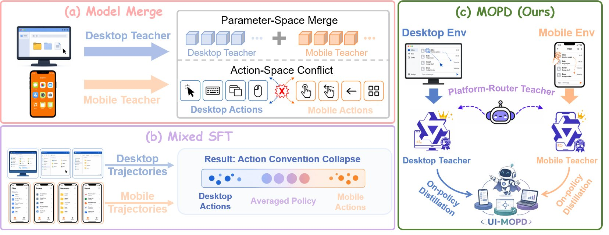

<div align="center">
  <h1>$\color{#FF6700}{\textsf{UI-MOPD}}$: Multi-platform On-Policy Distillation for Continual GUI Agent Learning</h1>
  <em>One 8B model. Two platforms. Zero forgetting.</em>
  <br><br>
  <a href="https://www.tsinghua.edu.cn/"></a>&nbsp;&nbsp;
  <a href="https://www.mi.com/"></a>&nbsp;&nbsp;
  <a href="https://www.hitsz.edu.cn/"></a>&nbsp;&nbsp;
  <a href="https://www.zju.edu.cn/"></a>
  <br>
  <sub>Tsinghua University &nbsp;•&nbsp; Xiaomi &nbsp;•&nbsp; HIT (Shenzhen) &nbsp;•&nbsp; Zhejiang University &nbsp;•&nbsp; Peng Cheng Laboratory</sub>
  <br><br>
  <a href="https://arxiv.org/pdf/2607.04425"></a>&nbsp;
  <a href="https://huggingface.co/UI-MOPD"></a>&nbsp;
  <a href="https://elispectre.github.io/UI-MOPD/"></a>
</div>

## Motivation

<p align="center">
  
</p>

Naively combining desktop and mobile signals — e.g., **model merging** or **mixed SFT** — mixes platform-specific behavioral conventions and produces an averaged policy that suffers from action-space conflict and catastrophic forgetting. **UI-MOPD** uses platform-conditioned routing and multi-teacher on-policy distillation to integrate platform-specific expertise into a single shared 8B GUI agent, enabling adaptation to new platforms while preserving capabilities on existing ones.

---

## Highlights

<table>
<tr>
<td width="33%" align="center">

**🔥 On-policy distillation**

Dual teachers guide the student with token-level KL on its own rollouts — no off-policy staleness

</td>
<td width="33%" align="center">

**🔀 Platform-conditioned router**

Automatically selects desktop or mobile teacher based on the current environment

</td>
<td width="33%" align="center">

**⚡ Efficient 8B student**

Single model serves both platforms — practical for real deployment on one node

</td>
</tr>
<tr>
<td width="33%" align="center">

**📊 160K-step dataset**

Cross-platform Uni-GUI dataset built with a 4-stage quality harness

</td>
<td width="33%" align="center">

**🔓 Full open-source pipeline**

Data → SFT → MOPD → Evaluation — all code released

</td>
<td width="33%" align="center">

**🏆 State-of-the-art**

38.2% OSWorld, 12.0% MobileWorld — beats Model Merge and Mixed SFT

</td>
</tr>
</table>

---

## Quick start

### 1. Download

| Resource                                                | Link                                                                                                         | Description                               |
| ------------------------------------------------------- | ------------------------------------------------------------------------------------------------------------ | ----------------------------------------- |
| **$\color{#FF6700}{\textsf{UI-MOPD Student}}$** | [Qwen3-VL-8B-Thinking-UI-MOPD-Student](https://huggingface.co/UI-MOPD/Qwen3-VL-8B-Thinking-UI-MOPD-Student)   | Final unified 8B agent (desktop + mobile) |
| Desktop teacher                                         | [Qwen3-VL-32B-Thinking-Desktop-Teacher](https://huggingface.co/UI-MOPD/Qwen3-VL-32B-Thinking-Desktop-Teacher) | 32B desktop teacher for MOPD              |
| Mobile teacher                                          | [Qwen3-VL-32B-Thinking-Mobile-Teacher](https://huggingface.co/UI-MOPD/Qwen3-VL-32B-Thinking-Mobile-Teacher)   | 32B mobile teacher for MOPD               |

### 2. Serve the model

```bash
# Using SGLang (recommended)
python -m sglang.launch_server \
    --model-path UI-MOPD/Qwen3-VL-8B-Thinking-UI-MOPD-Student \
    --port 8000 --tp 1

# Or using vLLM
vllm serve UI-MOPD/Qwen3-VL-8B-Thinking-UI-MOPD-Student --port 8000
```

### 3. Run evaluation

```bash
# Grounding benchmarks (8 GPUs)
cd eval && bash grounding/run_all.sh

# AndroidControl
python eval/androidcontrol/evaluate_androidcontrol.py \
    --steps ./androidcontrol/steps.jsonl \
    --images ./androidcontrol/images \
    --api-base http://localhost:8000/v1 \
    --model UI-MOPD --output results.jsonl
```

### 4. Training (reproduce from scratch)

```bash
# Stage 1: SFT teacher on desktop data
cd verl && bash ui_mopd/runs/run_sft_32B_Thinking.sh

# Stage 2: MOPD distillation to 8B student
cd verl && bash ui_mopd/runs/run_mopd.sh
```

---

## Method

<p align="center">
  
</p>

**$\color{#FF6700}{\textsf{Stage 1 — Teacher SFT:}}$** Train platform-specific 32B teachers (Qwen3-VL-32B-Thinking) on desktop and mobile data separately. Each teacher masters one platform's action space (`computer_use` for desktop, `mobile_use` for mobile).

**$\color{#FF6700}{\textsf{Stage 2 — MOPD:}}$** The 8B student generates rollouts in both environments. A platform-conditioned router selects the appropriate teacher, which provides **token-level reverse KL** guidance as an auxiliary loss alongside the GRPO + DAPO RL objective with rule-based GUI rewards (action match + grounding IoU).

> Full training details, hyperparameters, and launch scripts: [`verl/`](verl/)

---

## Main results

Baselines and integration strategies on OSWorld and MobileWorld (Table 1).

| Method | OSWorld | MobileWorld |
|---|:---:|:---:|
| ***General Models*** | | |
| SeedVL-1.5 | 34.1% | -- |
| Qwen3-VL-8B-Instruct | 33.9% | 9.4% |
| Qwen3-VL-8B-Thinking | 33.9% | 7.7% |
| Qwen3-VL-32B-Instruct | 32.6% | 9.0% |
| Qwen3-VL-235B-A22B-Instruct | 31.6% | 9.5% |
| Qwen3-VL-235B-A22B-Thinking | 38.1% | -- |
| ***GUI Models (Single-Platform)*** | | |
| OpenCUA-7B | 28.2% | -- |
| OpenAI CUA o3 | 31.3% | -- |
| OpenCUA-32B | 34.8% | -- |
| ***GUI Models (Multi-Platform)*** | | |
| UI-TARS-72B-DPO | 27.1% | -- |
| UI-TARS-1.5-7B | 27.4% | -- |
| GELab-Zero-4B | 31.9% | 10.9% |
| GUI-Owl-7B | 34.9% | 4.5% |
| GUI-Owl-32B | -- | 5.5% |
| ***Integration Strategies*** | | |
| Mixed-SFT | 35.0% | 6.4% |
| Model Merge (Weight Averaging) | 36.5% | 6.8% |
| Model Merge (TIES Merging) | 36.8% | 0% |
| $\color{#FF6700}{\textsf{🏆 UI-MOPD (Ours)}}$ | $\color{#FF6700}{\textsf{38.2\%}}$ | $\color{#FF6700}{\textsf{12.0\%}}$ |

### Teacher-Student Analysis

Teacher-student analysis on OSWorld and MobileWorld (Table 2).

| Method | OSWorld | MobileWorld |
|---|:---:|:---:|
| ***Base Models*** | | |
| Qwen3-VL-8B-Thinking | 33.9% | 7.7% |
| Qwen3-VL-32B-Thinking | 41.0% | 9.4% |
| ***Single-Platform SFT (8B)*** | | |
| 8B SFT on OSWorld | 35.8% | 0% |
| 8B SFT on MobileWorld | 35.8% | 12.8% |
| ***Platform-Specific Teachers (32B)*** | | |
| Desktop Teacher, 32B | 46.3% | -- |
| Mobile Teacher, 32B | -- | 16.2% |
| $\color{#FF6700}{\textsf{🏆 UI-MOPD (Ours)}}$ | $\color{#FF6700}{\textsf{38.2\%}}$ | $\color{#FF6700}{\textsf{12.0\%}}$ |

> UI-MOPD effectively distills knowledge from platform-specific 32B teachers into a shared 8B student, achieving balanced cross-platform performance that surpasses single-platform fine-tuning.

### GUI Grounding and Understanding

General GUI grounding, visual understanding, and AndroidControl results (Table 3).

| Model | AndroidControl* | ScreenSpot-Pro | ScreenSpotV2 | OSWorld-G |
|---|:---:|:---:|:---:|:---:|
| Qwen3-VL-8B-Thinking | 78.73% | 43.71% | 91.27% | 52.13% |
| Model Merge (TIES Merging) | 74.01% | 37.13% | 88.60% | 47.16% |
| $\color{#FF6700}{\textsf{🏆 UI-MOPD (Ours)}}$ | $\color{#FF6700}{\textsf{80.05\%}}$ | $\color{#FF6700}{\textsf{43.14\%}}$ | $\color{#FF6700}{\textsf{90.88\%}}$ | $\color{#FF6700}{\textsf{52.84\%}}$ |

> UI-MOPD preserves GUI grounding and visual understanding capabilities while improving interactive task performance, unlike static parameter merging which shows clear degradation.

> Evaluation scripts and full benchmark details: [`eval/`](eval/)

---

## Open-source models and datasets

### 🤖 Models

| Model                                                   |     Size     | Platform         |                                        Link                                        |
| ------------------------------------------------------- | :----------: | ---------------- | :--------------------------------------------------------------------------------: |
| **$\color{#FF6700}{\textsf{UI-MOPD Student}}$** | **8B** | Desktop + Mobile | [🤗 Download](https://huggingface.co/UI-MOPD/Qwen3-VL-8B-Thinking-UI-MOPD-Student) |
| Desktop teacher                                         |     32B     | Desktop          | [🤗 Download](https://huggingface.co/UI-MOPD/Qwen3-VL-32B-Thinking-Desktop-Teacher) |
| Mobile teacher                                          |     32B     | Mobile           | [🤗 Download](https://huggingface.co/UI-MOPD/Qwen3-VL-32B-Thinking-Mobile-Teacher) |
| Desktop SFT baseline                                    |      8B      | Desktop          |   [🤗 Download](https://huggingface.co/UI-MOPD/Qwen3-VL-8B-Thinking-Desktop-SFT)   |
| Mobile SFT baseline                                     |      8B      | Mobile           |    [🤗 Download](https://huggingface.co/UI-MOPD/Qwen3-VL-8B-Thinking-Mobile-SFT)    |

### 📦 Datasets (Uni-GUI)

| Dataset             | Platform     | Content                             |                                   Link                                   |
| ------------------- | ------------ | ----------------------------------- | :-----------------------------------------------------------------------: |
| Uni-GUI-Desktop-1   | 🖥️ Desktop | Self-collected desktop trajectories |  [🤗 Download](https://huggingface.co/datasets/UI-MOPD/Uni-GUI-Desktop-1)  |
| Uni-GUI-Desktop-2   | 🖥️ Desktop | Self-collected desktop trajectories |  [🤗 Download](https://huggingface.co/datasets/UI-MOPD/Uni-GUI-Desktop-2)  |
| Uni-GUI-OpenCUA     | 🖥️ Desktop | Cleaned OpenCUA trajectories        |   [🤗 Download](https://huggingface.co/datasets/UI-MOPD/Uni-GUI-OpenCUA)   |
| Uni-GUI-Mobile      | 📱 Mobile    | Self-collected mobile trajectories  |   [🤗 Download](https://huggingface.co/datasets/UI-MOPD/Uni-GUI-Mobile)   |
| Uni-GUI-OpenMobile  | 📱 Mobile    | Cleaned OpenMobile trajectories     | [🤗 Download](https://huggingface.co/datasets/UI-MOPD/Uni-GUI-OpenMobile) |
| AndroidControl-Star | 📱 Mobile    | AndroidControl evaluation set       | [🤗 Download](https://huggingface.co/datasets/UI-MOPD/AndroidControl-Star) |

---

## The Uni-GUI dataset

<p align="center">
  
</p>

A high-quality cross-platform dataset built with a **4-stage harness**: environment-grounded query generation → teacher rollouts → multi-stage cleaning → CoT normalization + bbox re-annotation.

| Platform        | Source                      |           Steps |     Trajectories |
| --------------- | --------------------------- | --------------: | ---------------: |
| 🖥️ Desktop    | Self-collected + OpenCUA    |           ~108K |            ~7.8K |
| 📱 Mobile       | Self-collected + OpenMobile |            ~52K |            ~3.7K |
| **Total** |                             | **~160K** | **~11.5K** |

> Pipeline details: [`uni_gui/`](uni_gui/) &nbsp;|&nbsp; Data processing scripts: [`data/`](data/)

---

### Data examples

<table>
<tr>
<td width="60%">

**🖥️ Desktop case** — Open terminal, create file


</td>
<td width="40%">

```json
{
  "device": "computer",
  "app": "OS",
  "query": "Open the terminal, navigate to
    Desktop/pp, create goast.out...",
  "data": [{
    "step": 1,
    "thought": "Plan: 1) Open terminal
      2) cd Desktop/pp 3) touch goast.out...",
    "action": "Click terminal icon",
    "plan": {
      "name": "computer_use",
      "arguments": {
        "action": "left_click",
        "coordinate": [18, 491]
      }
    },
    "bbox": [[5,473], [31,509]],
    "screenshot": "screenshot_step0.jpg"
  }]
}
```

</td>
</tr>
<tr>
<td width="60%">

**📱 Mobile case** — Adjust brightness to minimum


</td>
<td width="40%">

```json
{
  "device": "mobile",
  "app": "settings",
  "query": "Adjust display brightness
    to the lowest possible setting.",
  "data": [{
    "step": 1,
    "thought": "Plan: 1) Open Settings
      2) Navigate to Display
      3) Adjust brightness to min...",
    "action": "Tap Settings app icon",
    "plan": {
      "name": "mobile_use",
      "arguments": {
        "action": "click",
        "coordinate": [850, 821]
      }
    },
    "bbox": [[776,788], [924,854]],
    "screenshot": "screenshot_step0.jpg"
  }]
}
```

</td>
</tr>
</table>

Each trajectory contains: **structured chain-of-thought** (Observation → Plan → Reasoning → Expected), **tool-call action** with coordinates, **bounding box** for grounding reward, and **step-by-step screenshots**.

---

## Case studies

<table>
<tr>
<td width="50%" align="center">

**$\color{#FF6700}{\textsf{Desktop agent}}$**

Transfer data from LibreOffice Calc to Writer, preserving formatting, save as "price.docx"


</td>
<td width="50%" align="center">

**$\color{#FF6700}{\textsf{Mobile agent}}$**

Reply to email with attachment — compose subject, body, and select file


</td>
</tr>
</table>

---

## Data viewer

A lightweight Flask tool to inspect trajectory data — browse episodes, overlay click markers + bounding boxes, step through actions.

<table>
<tr>
<td></td>
<td></td>
</tr>
</table>

```bash
pip install flask
python data_viewer/server.py /path/to/trajectories
# → Open http://127.0.0.1:5020
```

> Full documentation: [`data_viewer/`](data_viewer/)

---

## Repository structure

```
UI-MOPD/
├── fig/                    Figures for README
├── data/                   Data pipeline: raw trajectories → training parquets
│   ├── sft/                  SFT parquet generators (desktop / mobile / mix)
│   ├── mopd/                 MOPD parquet generator (with bbox for reward)
│   └── dataset/              Example trajectories with screenshots
├── uni_gui/                Uni-GUI: 4-stage cross-platform data collection harness
├── verl/                   Training pipeline (verl framework + UI-MOPD extensions)
│   └── ui_mopd/              Launch scripts, configs, reward functions, OPD loss
├── eval/                   Evaluation across 6 benchmarks
│   ├── grounding/            ScreenSpot-Pro, V2, OSWorld-G
│   └── androidcontrol/       AndroidControl evaluation
├── data_viewer/            Flask-based trajectory visualization tool
├── demo/                   Complete inference demos with screenshots & logs
└── UI_MOPD.pdf             Paper
```

---

## Citation

```bibtex
@article{lian2026ui,
  title={UI-MOPD: Multi-Platform On-Policy Distillation for Continual GUI Agent Learning},
  author={Lian, Niu and Chen, Alan and Yu, Zhehao and Duan, Chengzhen and Liu, Fazhan and Liu, Hui and Fu, Pei and Luan, Jian and Wang, Yaowei and Xia, Shu-Tao and others},
  journal={arXiv preprint arXiv:2607.04425},
  year={2026}
}
```

---

<p align="center">
  <sub>If you find UI-MOPD useful, please consider giving us a ⭐!</sub>
</p>
