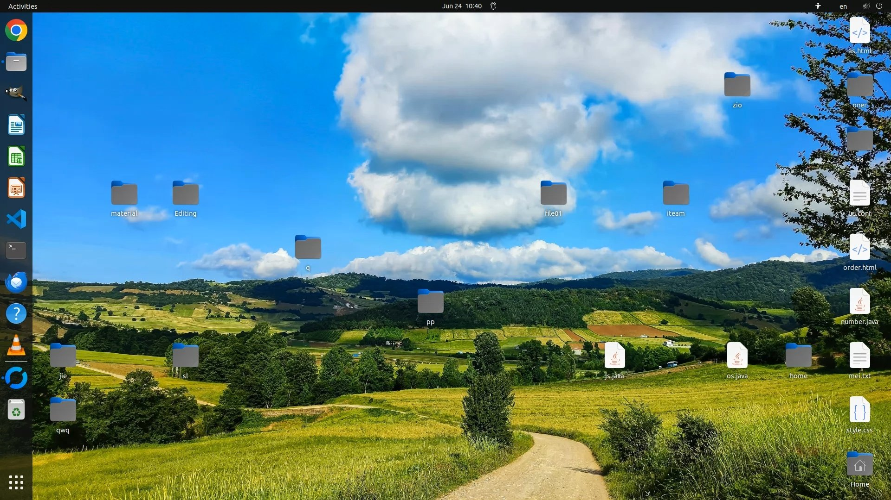
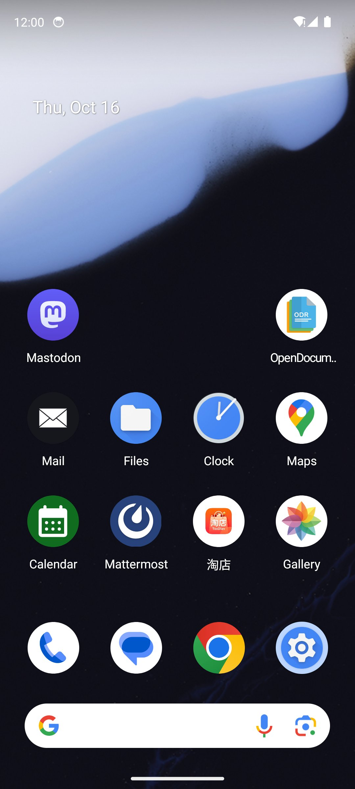

# $\color{#FF6700}{\textsf{Data Pipeline}}$

> From raw GUI trajectories to training-ready Parquet — one pipeline, two platforms, three output formats.

This directory houses everything between "human demonstrates a task on screen" and "model learns from it." Each trajectory is a sequence of screenshots + actions; the scripts here transform them into the Parquet files consumed by our SFT and MOPD training stages.

---

## Directory Map

```
data/
├── dataset/          Example trajectories (desktop + mobile) with screenshots
│   ├── desktop/      OSWorld-style: 1920×1080, file-system & app tasks
│   └── mobile/       MobileWorld-style: 1080×2400, settings & system tasks
├── sft/              Supervised Fine-Tuning parquet generators
│   ├── generate_desktop_sft_parquet.py
│   ├── generate_mobile_sft_parquet.py
│   └── generate_mix_sft_parquet.py
└── mopd/             Multi-teacher On-Policy Distillation parquet generator
    └── generate_mix_parquet.py
```

---

## How It All Fits Together

```
         ┌─────────────────────────────┐
         │   Raw Trajectories (JSON)   │
         │   screenshot_step0.png ...  │
         └────────────┬────────────────┘
                      │
          ┌───────────┴───────────┐
          ▼                       ▼
   ┌─────────────┐        ┌─────────────┐
   │  SFT Stage  │        │ MOPD Stage  │
   │  (Stage 1)  │        │  (Stage 2)  │
   └──────┬──────┘        └──────┬──────┘
          │                      │
          ▼                      ▼
  ┌───────────────┐    ┌────────────────┐
  │ Platform SFT  │    │  Mixed MOPD    │
  │ train/test    │    │  train/test    │
  │ .parquet      │    │  .parquet      │
  └───────────────┘    └────────────────┘
```

**Stage 1 (SFT):** Train platform-specific teachers. Each step becomes a `(system_prompt, user_prompt + screenshot, ground_truth_response)` tuple. Desktop and mobile have separate generators because their action spaces differ — `computer_use` vs `mobile_use`.

**Stage 2 (MOPD):** Distill multiple teachers into one unified student via reinforcement learning. The parquet adds `bbox` / `bbox2` fields for reward computation and mixes both platforms in a single file.

---

## Quick Start

```bash
# Generate desktop SFT parquet
python sft/generate_desktop_sft_parquet.py \
    --data_dir /path/to/desktop/trajectories \
    --output_dir ./output

# Generate mobile SFT parquet
python sft/generate_mobile_sft_parquet.py \
    --data_dir /path/to/mobile/trajectories \
    --output_dir ./output

# Generate mixed SFT parquet (both platforms combined)
python sft/generate_mix_sft_parquet.py \
    --mobile_dir /path/to/mobile \
    --desktop_dir /path/to/desktop \
    --output_dir ./output

# Generate MOPD parquet for RL training
python mopd/generate_mix_parquet.py \
    --mobile_dir /path/to/mobile \
    --desktop_dir /path/to/desktop \
    --output_dir ./output
```

---

## Output Format

All generators produce **train** and **test** splits. Each row in the Parquet contains:

| Column | Type | Description |
|--------|------|-------------|
| `data_source` | string | `"desktop"` or `"mobile"` |
| `prompt` | list[dict] | Chat-format messages (system + user with `<image>` placeholder) |
| `images` | list[dict] | Image path + resolution constraints (`min_pixels`, `max_pixels`) |
| `reward_model` | dict | Contains `ground_truth` response string |
| `ability` | string | Always `"gui_agent"` |
| `extra_info` | dict | Metadata: episode_id, step_id, app, image path |

MOPD parquet additionally includes `bbox` and `bbox2` in `extra_info` for grounding reward.

---

## Trajectory Viewer

We provide a lightweight Flask app ([`data_viewer/`](../data_viewer/)) to visually inspect trajectories before processing. It renders click coordinates, bounding boxes, and step-by-step actions on top of screenshots:

<p>

</p>

<p>

</p>

---

## Dataset Examples

See [`dataset/`](dataset/) for complete trajectory samples. Here's a quick peek at what the raw data looks like:

| Desktop (1920×1080) | Mobile (1080×2400) |
|:---:|:---:|
|  |  |
| *Open terminal and navigate to directory* | *Adjust brightness to minimum* |

Full dataset available at: [https://huggingface.co/UI-MOPD](https://huggingface.co/UI-MOPD)
