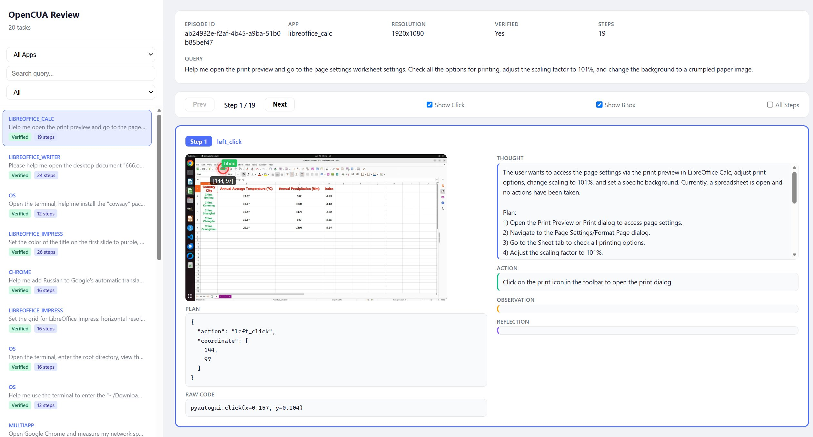
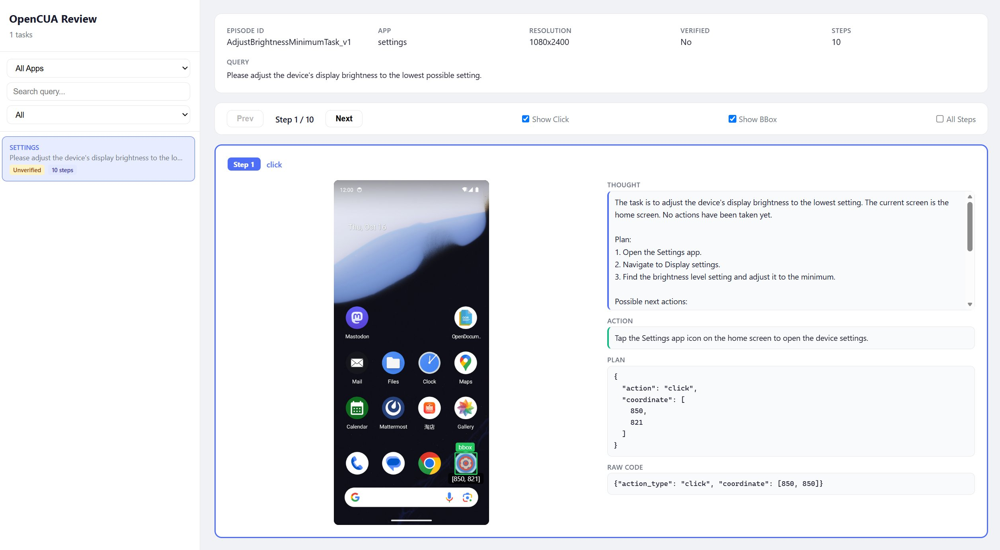

# $\color{#FF6700}{\textsf{GUI Trajectory Review App}}$

> One command. Zero config. Instantly browse your GUI agent trajectories.

A lightweight Flask-based web viewer for GUI agent trajectory data. Load thousands of episodes, step through each action with annotated screenshots, and catch data issues before they reach your training pipeline.

---

### Desktop Trajectory View



### Mobile Trajectory View



---

## Highlights

| | Feature | Description |
|---|---------|-------------|
| :rocket: | **Instant Launch** | Point at any trajectory folder, no config needed |
| :computer: :iphone: | **Cross-Platform** | Auto-detects desktop vs mobile and adjusts layout |
| :dart: | **Click Overlay** | $\color{red}{\textsf{Red markers}}$ show exact agent click coordinates |
| :green_square: | **BBox Overlay** | $\color{green}{\textsf{Green bounding boxes}}$ highlight target UI elements |
| :mag: | **Lightbox Zoom** | Click any screenshot for fullscreen + annotations |
| :keyboard: | **Keyboard Nav** | Arrow keys to step through actions instantly |
| :mag_right: | **Search & Filter** | Filter by app, keyword, or verified status |

## Quick Start

```bash
pip install flask
```

```bash
python server.py E:\dataset\UI-MOPD\OpenCUA
```

> [!TIP]
> Open http://127.0.0.1:5020 and start browsing immediately.

## More Examples

```bash
# Load ALL trajectories (no random sampling)
python server.py E:\dataset\UI-MOPD\OpenCUA --max_tasks 0

# Mobile trajectories
python server.py E:\dataset\UI-MOPD\mobile

# Custom port
python server.py E:\dataset\UI-MOPD\Uni-GUI-Desktop-1 --port 8080
```

## Usage

```
python server.py [DATA_DIR] [--port PORT] [--max_tasks N]
```

| Argument | Default | Description |
|----------|---------|-------------|
| `DATA_DIR` | `../case` | Path to directory containing trajectory folders |
| `--port` | `5020` | Server port |
| `--max_tasks` | `20` | Randomly sample N trajectories (0 = all) |

## Controls

| Key / Action | Result |
|-------------|--------|
| :arrow_left: `A` | Previous step |
| :arrow_right: `D` | Next step |
| `Esc` | Close fullscreen |
| :white_check_mark: Show Click | Toggle $\color{red}{\textsf{click coordinate markers}}$ |
| :white_check_mark: Show BBox | Toggle $\color{green}{\textsf{bounding box overlays}}$ |
| :white_check_mark: All Steps | Expand all steps vertically |
| Click screenshot | Fullscreen lightbox with annotations |

## Adaptive Layout

The viewer reads `"device"` from task.json:

| | Device | Screenshot | Right Panel |
|---|--------|-----------|-------------|
| :computer: | `computer` | Large (540px) | $\color{#4f6ef7}{\textsf{Thought}}$, $\color{#10b981}{\textsf{Action}}$, $\color{#f59e0b}{\textsf{Observation}}$, $\color{#8b5cf6}{\textsf{Reflection}}$ |
| :iphone: | `mobile` | Compact (260px) | $\color{#4f6ef7}{\textsf{Thought}}$, $\color{#10b981}{\textsf{Action}}$, Plan, Raw Code |

> [!NOTE]
> Desktop trajectories show Plan and Raw Code below the screenshot.
> Mobile trajectories move them to the right panel for a cleaner vertical layout.

## Data Format

```
data_dir/
  episode_001/
    task.json              # metadata + step records
    screenshot_step0.png
    screenshot_step1.png
    ...
```

<details>
<summary><b>task.json example</b> (click to expand)</summary>

```json
{
  "episode_id": "a42e4191-596c-48b7-ab75-c3bdb6d72e90",
  "app": "OS",
  "device": "computer",
  "query": "Open the terminal, enter the working directory...",
  "screen_resolution": [1920, 1080],
  "verified": true,
  "data": [
    {
      "step": 1,
      "thought": "The current state shows the desktop...",
      "action": "Click on the terminal icon...",
      "plan": {
        "name": "computer_use",
        "arguments": {"action": "left_click", "coordinate": [18, 441]}
      },
      "screenshot": "screenshot_step0.png",
      "code": "pyautogui.click(x=0.022, y=0.434)"
    }
  ]
}
```

</details>

## Dependencies

```bash
pip install flask
```

> [!IMPORTANT]
> No database. No build step. No npm. Just Flask.
