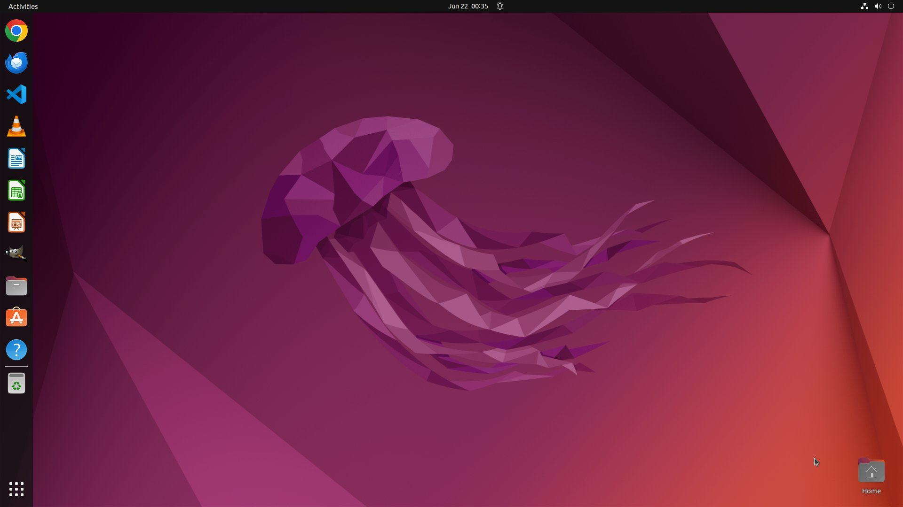
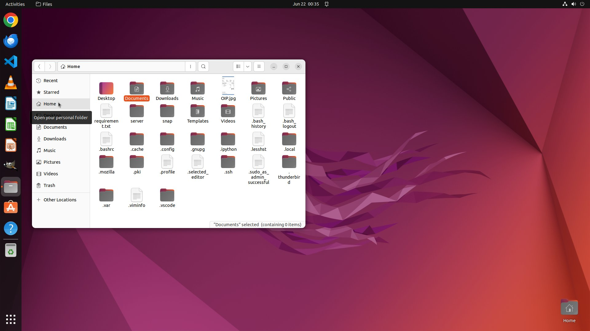
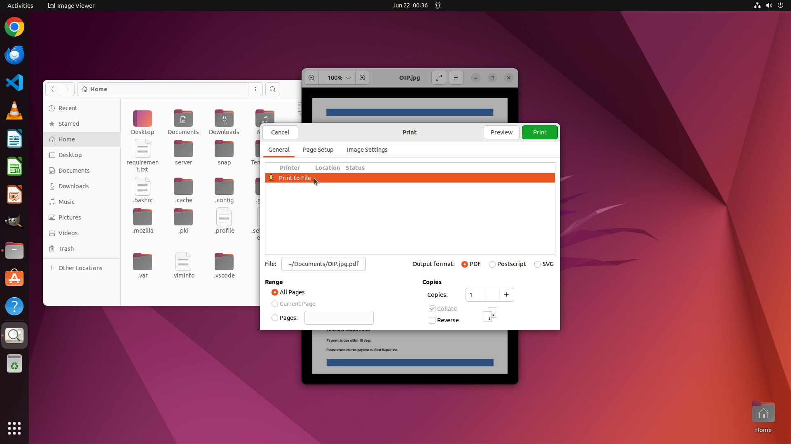
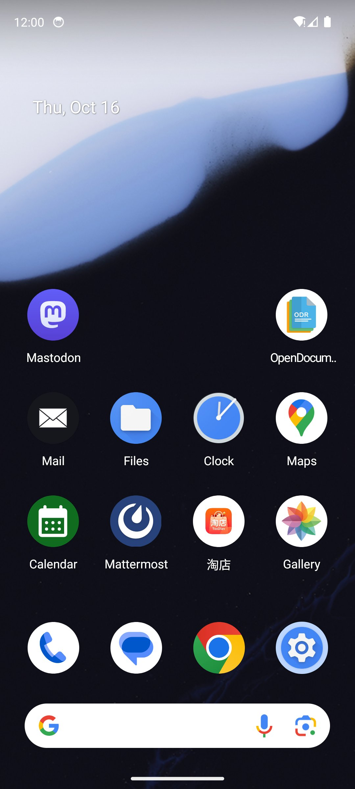
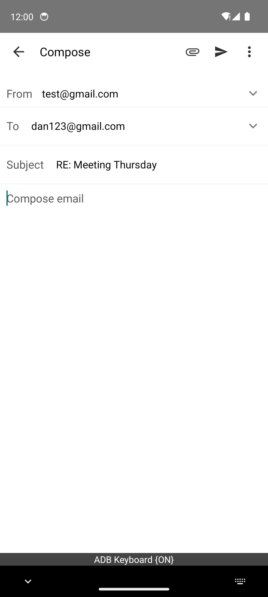
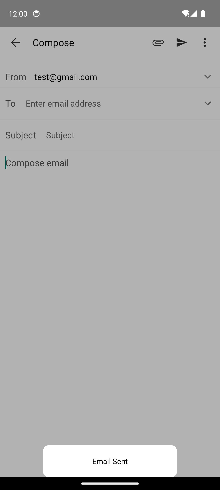

# $\color{#FF6700}{\textsf{Demo: UI-MOPD in Action}}$

> Watch our 8B model complete real tasks — from desktop file management to mobile email replies — step by step.

This directory contains complete inference trajectories produced by **UI-MOPD (Qwen3-VL-8B-Thinking)** on real GUI environments. Each demo includes the full runtime trace: screenshots at every step, the model's chain-of-thought + action output, and the final task score.

---

## Included Demos

| Demo | Platform | Task | Steps | Result |
|------|----------|------|:-----:|:------:|
| [`osworld/`](osworld/) | :computer: Desktop | Convert a receipt image to PDF | 17 | :white_check_mark: Success |
| [`AcceptMeetingTask/`](AcceptMeetingTask/) | :iphone: Mobile | Reply to Daniel's email about the Thursday meeting | 7 | :white_check_mark: Success |

---

## Desktop Demo: Receipt → PDF

> **Query**: "I have an image of my receipt located in /home/user. I'm looking to transform it into a PDF file. Can you assist me with this task? Save the resulting PDF as 'receipt.pdf' on the desktop."

The agent opens the file manager, locates the receipt image, opens it, and uses the "Print to PDF" workflow to save `receipt.pdf` to the Desktop — all via GUI interactions.

<table>
<tr>
<td></td>
<td></td>
<td></td>
</tr>
<tr>
<td align="center"><i>Step 0: Open file manager</i></td>
<td align="center"><i>Step 3: Navigate to home</i></td>
<td align="center"><i>Step 8: Print to PDF</i></td>
</tr>
</table>

**Files:**
- `query.txt` — Task instruction
- `traj.jsonl` — Full trajectory (model outputs per step)
- `runtime.log` — Raw inference log with model responses
- `step_*.jpg` — Screenshot at each step
- `result.txt` — Final score: **1.0** (task completed successfully)

---

## Mobile Demo: Reply to Email

> **Task**: "Reply to Daniel's most recent email to tell him: 'I'll be there at 10:00 AM on Thursday.'"

The agent opens the Mail app, finds Daniel's email, taps reply, types the message, and sends it.

<table>
<tr>
<td></td>
<td></td>
<td></td>
<td></td>
</tr>
<tr>
<td align="center"><i>Open Mail</i></td>
<td align="center"><i>Find email</i></td>
<td align="center"><i>Type reply</i></td>
<td align="center"><i>Send</i></td>
</tr>
</table>

**Files:**
- `traj.json` — Full trajectory with action coordinates
- `screenshots/` — Screenshots at each interaction step
- `result.txt` — Score: **1.0**, reason: "Correct email sent"

---

## How to Read the Trajectories

Each step in the trajectory contains:

```json
{
  "task_goal": "Reply to Daniel's most recent email...",
  "step": 1,
  "prediction": "Action: Tap the Mail app icon...\n<tool_call>\n{\"name\": \"mobile_use\", \"arguments\": {\"action\": \"click\", \"coordinate\": [148, 530]}}\n</tool_call>",
  "action": {"action_type": "click", "x": 160, "y": 1273}
}
```

The model produces a natural-language action description + a structured `<tool_call>` that the environment executor interprets. Coordinates are in the model's normalized [0, 1000] space; the `action` field shows the actual pixel coordinate sent to the device.

---

## Reproduce

To run UI-MOPD inference yourself:

1. Serve the model via SGLang or vLLM (OpenAI-compatible API)
2. Connect to OSWorld (desktop) or MobileWorld (mobile) environments
3. Point the agent framework at your served model endpoint

See [`eval/`](../eval/) for evaluation scripts and [`verl/`](../verl/) for training details.
