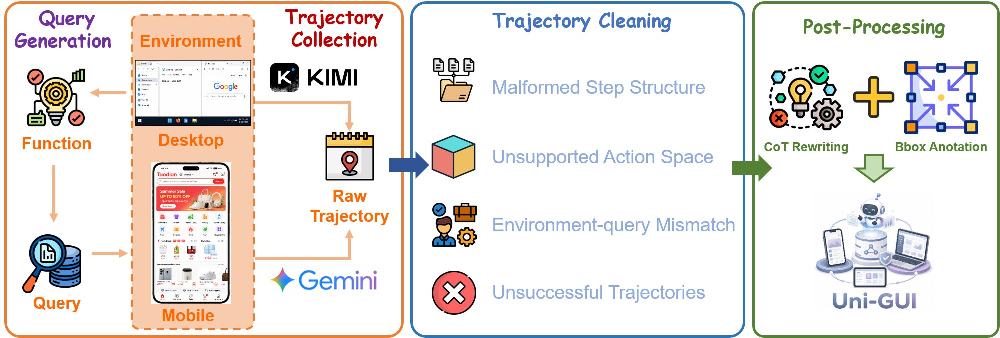

# $\color{#FF6700}{\textsf{Uni-GUI: Unified Cross-Platform Data Collection Harness}}$

> Four stages. Two platforms. One unified trajectory format — ready for any VLM training pipeline.

Collecting high-quality GUI agent trajectories is hard: the instruction must match the environment state, the action must be representable by the student policy, and the target element must be visually groundable. These issues multiply in a cross-platform setting where desktop and mobile use completely different observation formats, action primitives, and UI layouts.

Our harness organizes data construction into **four sequential stages**, each with platform-specific implementations that converge into a shared output format.

<p align="center">

</p>

---

## Pipeline Overview

```
┌──────────────────┐     ┌──────────────────┐     ┌──────────────────┐     ┌──────────────────┐
│  Query           │     │  Trajectory      │     │  Trajectory      │     │  Post-           │
│  Generation      │────▶│  Collection      │────▶│  Cleaning        │────▶│  Processing      │
└──────────────────┘     └──────────────────┘     └──────────────────┘     └──────────────────┘
 Environment-grounded     Teacher rollouts         Multi-stage filter       Normalize format
 functional-point          in live GUI              + success judge          + re-annotate bbox
 extraction                environments
```

| Stage | Desktop | Mobile |
|-------|---------|--------|
| **Query Generation** | Kimi-K2.6 extracts functional points from OSWorld environments | Gemini-3.1-Pro extracts from MobileWorld / AndroidWorld |
| **Trajectory Collection** | Kimi-K2.6 interacts with desktop GUI | Gemini-3.1-Pro interacts with mobile GUI |
| **Trajectory Cleaning** | Format check → action-space filter → length filter → success judge | Same pipeline, mobile action-space |
| **Post-Processing** | Normalize reasoning → re-annotate grounding bbox | Same + scroll disambiguation |

---

## Directory Structure

```
uni_gui/
├── fig/
│   └── harness.png                    Pipeline overview figure
├── computer/                          Desktop pipeline
│   ├── generate_new_queries.py/.sh    Stage 1: query generation
│   ├── convert_osworld_to_taskjson.py Stage 2: raw → unified task.json
│   ├── clean_trajectories.py/.sh      Stage 3: multi-stage cleaning
│   ├── fix_bbox.py/.sh                Stage 4: re-annotate bounding boxes
│   └── regenerate_thought.py/.sh      Stage 4: normalize reasoning traces
└── mobile/                            Mobile pipeline
    ├── generate_new_queries.py/.sh    Stage 1: query generation
    ├── convert_mobileworld_to_taskjson.py  Stage 2: raw → unified task.json
    ├── clean_trajectories.py/.sh      Stage 3: multi-stage cleaning
    ├── fix_grounding.py/.sh           Stage 4: re-annotate grounding
    ├── gemini_scroll_resolver.py      Stage 4: disambiguate scroll actions
    ├── regenerate_thought.py/.sh      Stage 4: normalize reasoning traces
    └── app_map.py                     App name → package mapping
```

---

## Stage Details

### Stage 1: Query Generation

Instead of freely generating arbitrary instructions, we ask teacher models to **identify realistic, executable functionalities** in the target environment, then synthesize natural user queries from those functional points.

```bash
# Desktop: generate queries from OSWorld environments
cd computer && bash generate_new_queries.sh

# Mobile: generate queries from MobileWorld/AndroidWorld environments
cd mobile && bash generate_new_queries.sh
```

This environment-grounded design reduces trajectories for underspecified, infeasible, or state-mismatched tasks.

### Stage 2: Trajectory Collection

Given a generated query, the teacher model interacts with the live GUI environment to produce an execution trajectory. Each trajectory records observations, actions, intermediate reasoning, and task states.

```bash
# Convert raw teacher outputs to unified task.json format
python computer/convert_osworld_to_taskjson.py --input_dir ... --output_dir ...
python mobile/convert_mobileworld_to_taskjson.py --input_dir ... --output_dir ...
```

### Stage 3: Trajectory Cleaning

Raw trajectories are noisy. We apply a multi-stage filter:

1. **Structure check** — remove trajectories with non-contiguous or duplicated steps
2. **Action-space filter** — discard trajectories with actions outside the student's vocabulary
3. **Length filter** — remove trajectories > 40 steps (likely inefficient exploration)
4. **Query consistency** — remove trajectories whose queries don't match the environment
5. **Success judge** — use Gemini-3.1-Pro to decompose each query into sub-tasks and verify all sub-tasks are completed

```bash
cd computer && bash clean_trajectories.sh
cd mobile && bash clean_trajectories.sh
```

### Stage 4: Post-Processing

After cleaning, we normalize for the Qwen-VL training format:

- **Reasoning normalization** — rewrite heterogeneous teacher reasoning into a consistent chain-of-thought structure aligned with Qwen3-VL
- **Grounding re-annotation** — re-annotate bounding boxes for actions targeting visual UI elements (used for rule-based reward in RL)
- **Scroll disambiguation** (mobile only) — resolve ambiguous scroll directions via Gemini visual verification

```bash
# Desktop post-processing
cd computer
bash regenerate_thought.sh
bash fix_bbox.sh

# Mobile post-processing
cd mobile
bash regenerate_thought.sh
bash fix_grounding.sh
```

---

## Dataset Composition

The final Uni-GUI dataset combines self-collected and cleaned open-source trajectories:

| Platform | Source | Steps | Trajectories |
|----------|--------|------:|-------------:|
| Desktop | Self-collected | ~95K | ~7K |
| Desktop | OpenCUA | ~13K | ~0.8K |
| Mobile | Self-collected | ~17K | ~1K |
| Mobile | OpenMobile | ~35K | ~2.7K |
| **Total** | | **~160K** | **~11.5K** |

OpenCUA and OpenMobile are **not used raw** — they are processed through the same Stage 3 + 4 pipeline (action-space filter, cleaning, normalization) before inclusion.

---

## Output Format

Each trajectory is stored as an episode directory:

```
episode_id/
├── task.json              # Normalized trajectory (used for training)
├── task_raw.json          # Original teacher output (for traceability)
├── screenshot_step0.png   # Screenshots indexed by step
├── screenshot_step1.png
└── ...
```

The `task.json` contains episode metadata (source, app, device, resolution, query, episode_id, train/test split) and a `data` array where each step records: step index, normalized thought, action description, tool-call plan, screenshot path, bounding boxes, and review flags.

---

## Action Spaces

| Platform | Tool Interface | Actions |
|----------|---------------|---------|
| Desktop | `computer_use` | key, type, mouse_move, left_click, left_click_drag, right_click, middle_click, double_click, triple_click, scroll, wait, terminate |
| Mobile | `mobile_use` | click, long_press, swipe, type, answer, system_button, wait, ask_user, terminate |

---

## Requirements

- Python 3.8+
- Access to teacher model APIs (Kimi-K2.6 for desktop, Gemini-3.1-Pro for mobile)
- GUI environments: OSWorld (desktop), MobileWorld / AndroidWorld (mobile)

Full dataset available at: [https://huggingface.co/UI-MOPD](https://huggingface.co/UI-MOPD)
