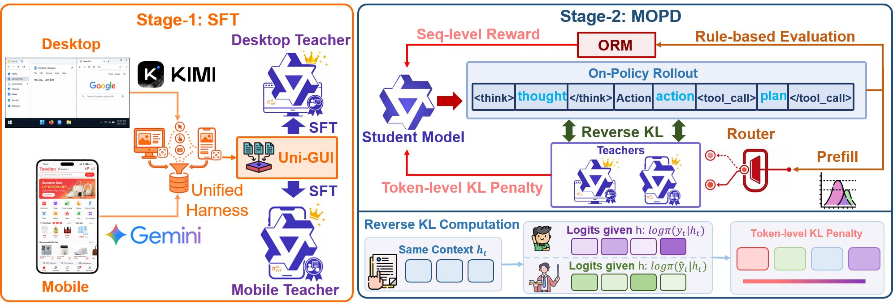
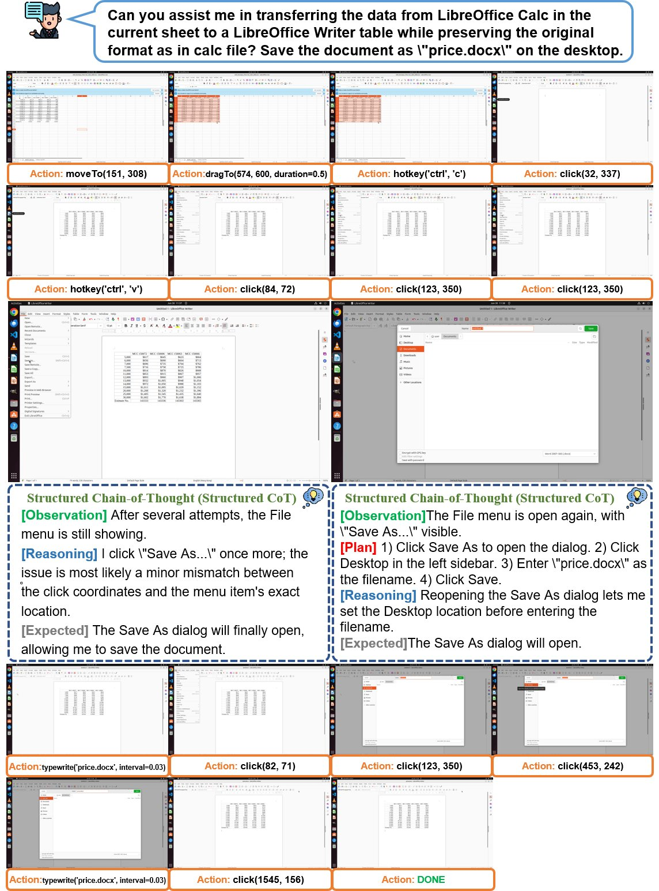
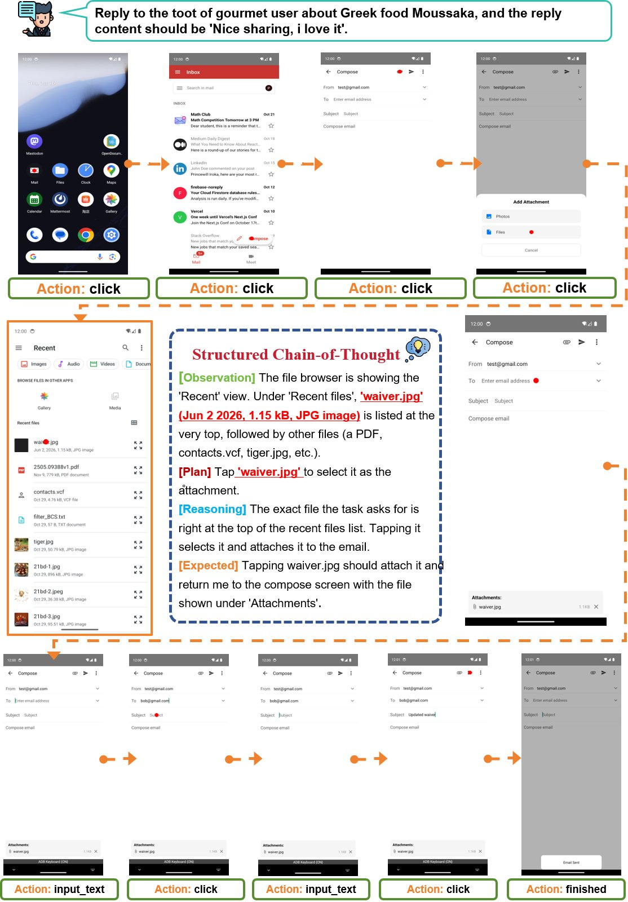

# $\color{#FF6700}{\textsf{Training: Two-Stage Cross-Platform GUI Agent}}$

> **Stage 1** — SFT platform-specific 32B teachers.  **Stage 2** — Distill into a unified 8B student via MOPD.

This directory contains the complete training pipeline built on top of [verl](https://github.com/volcengine/verl) (Volcano Engine RL framework). We extend verl with custom reward functions, multi-teacher on-policy distillation (OPD) loss, and GUI-agent-specific data loading.

<p align="center">

</p>

---

## Training Pipeline at a Glance

```
                                          ┌───────────────────────────────┐
                                          │       Uni-GUI Dataset         │
                                          │  ~160K steps, 11.5K trajs     │
                                          └───────────────┬───────────────┘
                                                          │
                                     ┌────────────────────┼────────────────────┐
                                     ▼                                         ▼
                     ┌───────────────────────────┐          ┌───────────────────────────┐
                     │   🖥️  Desktop Teacher     │          │   📱  Mobile Teacher      │
                     │   Qwen3-VL-32B-Thinking  │          │   Qwen3-VL-32B-Thinking  │
                     │   SFT on desktop data     │          │   SFT on mobile data      │
                     └─────────────┬─────────────┘          └─────────────┬─────────────┘
                                   │              Stage 1 (SFT)            │
                     ══════════════╪═══════════════════════════════════════╪══════════════
                                   │              Stage 2 (MOPD)           │
                                   ▼                                       ▼
                     ┌──────────────────────────────────────────────────────────────────┐
                     │                    🎓  Unified Student                           │
                     │                    Qwen3-VL-8B-Thinking                         │
                     │                                                                  │
                     │   GRPO + DAPO objective                                         │
                     │   + OPD KL auxiliary loss (dual-teacher distillation)           │
                     │   + Rule-based GUI reward (action match + grounding)            │
                     │                                                                  │
                     │   8 rollouts/prompt · SGLang async inference                    │
                     │   64×H100 · Megatron-LM parallelism                            │
                     └─────────────────────────────────┬────────────────────────────────┘
                                                       │
                                                       ▼
                                          ┌───────────────────────────┐
                                          │   🏆  UI-MOPD Agent       │
                                          │   Cross-platform (D+M)    │
                                          │   Single 8B model         │
                                          └───────────────────────────┘
```

---

## Directory Structure

```
verl/
├── ui_mopd/                        Our training code
│   ├── runs/
│   │   ├── run_sft_32B_Thinking.sh    Stage 1: Teacher SFT launch script
│   │   └── run_mopd.sh               Stage 2: MOPD (RL + OPD) launch script
│   ├── config/
│   │   ├── sft_trainer_engine.yaml    Hydra config for SFT
│   │   └── dapo_megatron_trainer.yaml Hydra config for MOPD
│   ├── main_dapo.py                   MOPD entry point
│   ├── dapo_trainer.py                RayDAPOTrainer with OPD extensions
│   ├── sft.py                         SFT training entry point
│   ├── dataset/
│   │   ├── dataset_utils.py           SFT data collator
│   │   ├── multiturn_sft_dataset.py   Multi-turn SFT dataset loader
│   │   ├── dynsam_dataloader.py       Dynamic sampling dataloader
│   │   └── thought_buffer.py          Thought history buffer for RL
│   ├── reward/
│   │   ├── gui_agent.py               Rule-based GUI reward functions
│   │   ├── gui_agent_thought_verify.py Thought quality verifier
│   │   └── knowledge_config.py        Knowledge matching config
│   ├── rejected/
│   │   └── rejected_samples.py        Rejected sample analysis
│   └── metric/
│       └── utils.py                   Validation metric processing
├── verl/                           verl framework (modified)
├── recipe/                         Training recipes & configs
├── scripts/                        Utility scripts
└── requirements*.txt               Dependencies
```

---

## Stage 1: Teacher SFT

Train platform-specific 32B teachers with supervised fine-tuning. Each teacher specializes in one platform's action space.

| | Desktop Teacher | Mobile Teacher |
|---|---|---|
| **Base Model** | Qwen3-VL-32B-Thinking | Qwen3-VL-32B-Thinking |
| **Action Space** | `computer_use` (12 actions) | `mobile_use` (9 actions) |
| **Training Data** | ~108K desktop steps | ~52K mobile steps |
| **Epochs** | 1 | 1 |
| **Parallelism** | TP=4, Megatron | TP=4, Megatron |

```bash
# Launch Stage 1 (example: desktop teacher)
export TRAINING_DATASET="/path/to/desktop_sft_train.parquet"
export VAL_DATASET="/path/to/desktop_sft_test.parquet"
export MODEL_PATH="/path/to/Qwen3-VL-32B-Thinking"
export PROJECT="stage1-desktop-teacher"
export NODES=4

bash ui_mopd/runs/run_sft_32B_Thinking.sh
```

---

## Stage 2: MOPD (Multi-teacher On-Policy Distillation)

Distill both teachers into a single 8B student using GRPO-based DAPO with an OPD KL auxiliary loss.

| Parameter | Value |
|-----------|-------|
| **Student** | Qwen3-VL-8B-Thinking |
| **Teachers** | Desktop 32B + Mobile 32B (dual-teacher) |
| **Algorithm** | GRPO + DAPO + OPD KL |
| **KL Loss** | Type k3, coefficient 0.01 |
| **Rollouts** | 8 per prompt |
| **Batch Size** | 128 train, 384 generation |
| **Clip Ratio** | Low=0.2, High=0.28, C=10.0 |
| **Rollout Engine** | SGLang (async mode) |
| **Infrastructure** | 8 nodes × 8 H100 GPUs = 64 GPUs |
| **Student Parallelism** | TP=2, DP=32 |
| **Teacher Parallelism** | TP=8, DP=8 |

```bash
# Launch Stage 2
export TRAIN_FILES="/path/to/mix_mopd_train.parquet"
export VAL_FILES="/path/to/mix_mopd_test.parquet"
export MODEL_PATH="/path/to/Qwen3-VL-8B-Thinking"
export REF_MODEL_PATH="/path/to/stage1-desktop-teacher/huggingface"
export REF_MODEL_PATH_MOBILE="/path/to/stage1-mobile-teacher/huggingface"
export NODES=8

bash ui_mopd/runs/run_mopd.sh
```

---

## Reward Design

The GUI agent reward combines multiple rule-based signals:

| Reward Component | Description |
|-----------------|-------------|
| **Action Match** | Exact match of action type and arguments against ground truth |
| **Grounding** | IoU between predicted click/tap coordinate and target bounding box |
| **Format** | Correct `<tool_call>` XML structure and valid JSON |
| **Overlong Penalty** | Penalty factor for responses exceeding buffer length |

Reward functions are implemented in [`ui_mopd/reward/gui_agent.py`](ui_mopd/reward/gui_agent.py).

---

## Key Technical Features

| Feature | Description |
|---------|-------------|
| :zap: **OPD Loss** | On-Policy Distillation — KL divergence between student and teacher logits as auxiliary loss |
| :arrows_counterclockwise: **Dual-Teacher** | Desktop teacher for `computer_use`, mobile teacher for `mobile_use`; selected by `data_source` field |
| :chart_with_upwards_trend: **DAPO** | Dynamic sampling with filter groups, rollout correction (IS/RS), and token-level veto |
| :rocket: **Async Rollout** | SGLang-based asynchronous generation for high GPU utilization |
| :building_construction: **Megatron-LM** | Tensor/Pipeline/Expert parallelism via mbridge for efficient multi-node training |
| :floppy_disk: **Dynamic Batch** | Token-level dynamic batching for variable-length multimodal sequences |

---

## Case Studies

<table>
<tr>
<td width="50%">

### Desktop Task Execution

Multi-step desktop GUI interaction: window management, file operations, cursor-based navigation.



</td>
<td width="50%">

### Mobile Task Execution

Touch-based mobile interaction: swipe, tap, system navigation across apps and settings.



</td>
</tr>
</table>

---

## Dependencies

```bash
pip install -r requirements.txt

# For SGLang rollout engine
pip install -r requirements_sglang.txt
```

Key dependencies:
- `verl` (included, modified for OPD support)
- `torch` + `megatron-core` (Megatron-LM parallelism)
- `sglang` (async rollout engine)
- `transformers` (Qwen3-VL model loading)
- `datasets` (Parquet data loading)

---

## Citation

If you find this training code useful, please cite:

```bibtex
@misc{lian2026uimopdmultiplatformonpolicydistillation,
      title={UI-MOPD: Multi-Platform On-Policy Distillation for Continual GUI Agent Learning}, 
      author={Niu Lian and Alan Chen and Zhehao Yu and Chengzhen Duan and Fazhan Liu and Hui Liu and Pei Fu and Jian Luan and Yaowei Wang and Shu-Tao Xia and Jinpeng Wang},
      year={2026},
      eprint={2607.04425},
      archivePrefix={arXiv},
      primaryClass={cs.CL},
      url={https://arxiv.org/abs/2607.04425}, 
}
```

Full model and dataset available at: [https://huggingface.co/UI-MOPD](https://huggingface.co/UI-MOPD)
